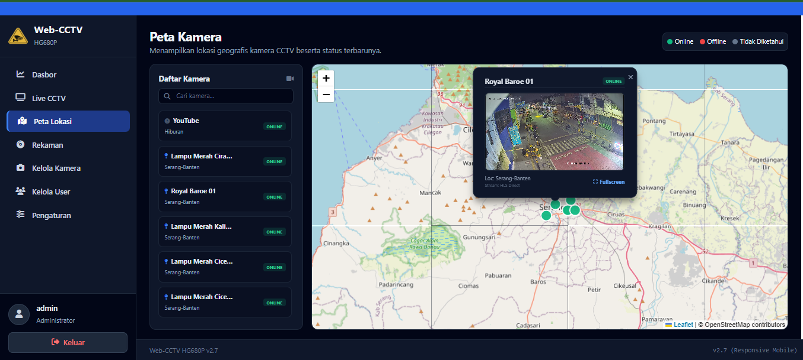
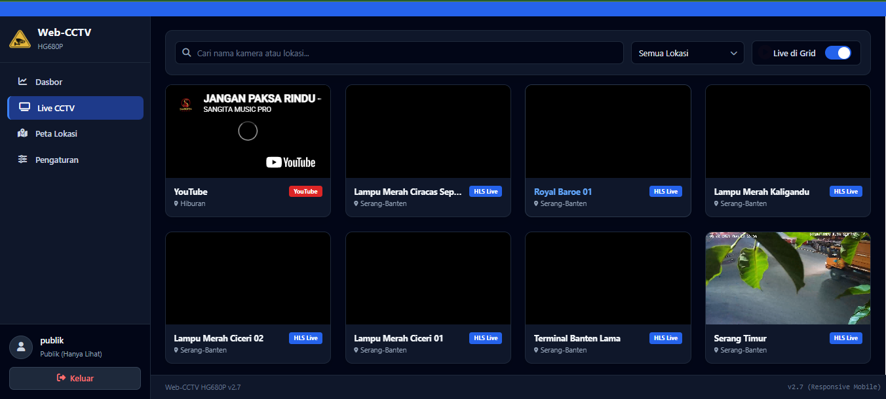
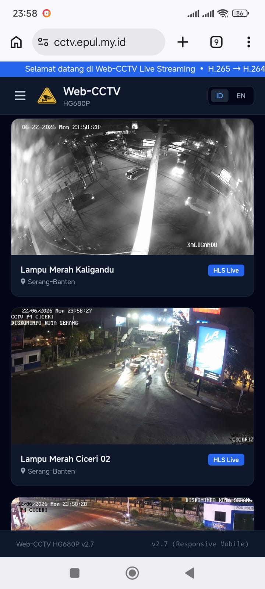

# Web-CCTV HG680P v2.7 (Release Produksi Stabil, Aman & Hemat Daya)

Sistem Web-CCTV modern, ultra-ringan, hemat CPU, dan responsif mobile – dirancang khusus untuk berjalan secara optimal 24 jam non-stop pada perangkat **STB Armbian HG680P / B860H (Amlogic S905X)** dengan memori terbatas (1GB - 2GB RAM).

Rilis **v2.7** menyajikan arsitektur satu dashboard dinamis (`index.html`) yang tangguh, sistem keamanan berbasis peran (RBAC) yang ketat, pencegah kerusakan SD Card terintegrasi, serta tampilan login premium yang elegan dan fleksibel.

---

## 📊 Galeri Antarmuka Web-CCTV (Screenshots)

Berikut adalah dokumentasi tampilan antarmuka dari sistem **Web-CCTV HG680P v2.7** baik pada perangkat Desktop maupun Ponsel:

### 1. Tampilan Grid Live CCTV (Desktop Admin)
*Tampilan pemantauan terpusat dengan multi-snapshot grid berkendala CPU sangat rendah.*


### 2. Tampilan Peta Interaktif & Live Popup Player
*Integrasi peta Leaflet + OpenStreetMap. Klik pada pin kamera hijau untuk memutar video live langsung di atas balon peta secara asinkron.*


### 3. Tampilan Dasbor Akun Publik (Terbatas & Aman)
*Login khusus peran Publik (username: `publik`) hanya diizinkan melihat kamera yang dicentang aktif oleh Administrator. Menu sensitif otomatis disembunyikan.*


### 4. Tampilan Responsif Mobile (Ponsel Portrait)
*Antarmuka ultra-responsif yang menyesuaikan ukuran layar ponsel secara instan, sangat pas diakses dari HP atau APK Android Hybrid.*


---

## 🏗️ Mengapa Sistem v2.7 Sangat Ringan di STB HG680P?

Untuk menjaga CPU STB tetap dingin (**di bawah 30% pemakaian CPU**), sistem v2.7 mengimplementasikan **Formula Emas Transcode Video & Pengolahan Gambar**:

1. **Preset Ultrafast (`-preset ultrafast`)**: Memotong beban encoding CPU hingga lebih dari 75% dibandingkan preset bawaan FFmpeg standar.
2. **Resolusi & Frame Rate Optimal (`960x540 @15fps`)**: Menurunkan resolusi ke 540p dan FPS ke 15 (standar CCTV keamanan). Ini memangkas piksel yang harus dihitung sebanyak 4x lipat dibanding 1080p, sekaligus sangat menghemat ruang penyimpanan.
3. **Kompatibilitas Mutlak H.264 Baseline**: Banyak kamera IP menggunakan format HEVC (H.265). Karena peramban web (Chrome, Safari, Edge, Firefox) **tidak mendukung H.265 secara native**, rekaman mentah akan menghasilkan **blank hitam** di pemutar web. Sistem v2.7 otomatis men-transcode video ke H.264 Baseline Profile agar **100% langsung bisa diputar di web/HP Android**.
4. **Perekaman Tanpa Audio (`-an`)**: IP camera murah umumnya mengirim audio berkode PCM G.711 (PCMA/PCMU). Jika dipaksa disalin ke wadah MP4, FFmpeg akan langsung crash dalam 2 detik. Мы menonaktifkan audio (`-an`) untuk menjamin stabilitas perekaman tanpa crash.
5. **Pemuat Snapshot Ringan (Mata Dewa)**: Pada grid live, sistem menggunakan penarikan berkas gambar snapshot JPEG berkala dari `/api/snapshot/:id` (penyegaran otomatis setiap 6 detik) alih-alih memutar banyak aliran video HLS secara bersamaan. Aliran video HLS asli hanya diputar ketika kamera diklik secara terfokus pada jendela modal player, menghemat penggunaan memori hingga 90%!
6. **Pemantauan Suhu, CPU & RAM STB Real-Time**: Pada panel "Spesifikasi & Informasi" di dashboard, sistem v2.7 secara native memantau persentase pemakaian CPU, alokasi memori RAM terpakai, serta sensor suhu termal (thermal sensor) STB secara langsung dari kernel Linux `/sys/class/thermal`. Hal ini membantu Anda memantau "kesehatan" STB saat bekerja keras!

---

## 🎨 Spesifikasi Visual & Kustomisasi Login Premium

Halaman masuk (*login page*) pada v2.7 telah didesain ulang menggunakan gaya **Dark Glassmorphism** (transparansi gelap) yang sangat premium dan mendukung penjenamaan (*branding*) mandiri:

### A. Dimensi & Aturan Berkas Logo PNG Kustom
Sistem mendukung penjenamaan logo kustom Anda secara dinamis. Anda hanya perlu meletakkan file gambar PNG Anda ke dalam folder `public/` dengan spesifikasi berikut:

1. **Logo Halaman Login (`logo-login.png`)**:
   - **Nama File**: `logo-login.png` (Wajib persis)
   - **Lokasi Penyimpanan**: `/opt/webcctv/public/logo-login.png`
   - **Ukuran Rekomendasi**: **256 x 256 piksel** (Akan dirender secara otomatis pada resolusi **56 x 56 piksel** / kelas Tailwind `w-14 h-14` dengan gradasi tameng berdenyut).
   - **Tipe File**: PNG transparan (.png).

2. **Logo Utama & Sidebar Navigasi (`logo.png`)**:
   - **Nama File**: `logo.png` (Wajib persis)
   - **Lokasi Penyimpanan**: `/opt/webcctv/public/logo.png`
   - **Ukuran Rekomendasi**: **128 x 128 piksel** (Akan dirender otomatis pada ukuran **36 x 36 piksel** / kelas `w-9 h-9` pada sidebar desktop, dan **28 x 28 piksel** / kelas `w-7 h-7` pada header mobile).
   - **Tipe File**: PNG transparan (.png).

> **💡 Fitur Fail-Safe Fallback**: Jika berkas `logo-login.png` atau `logo.png` tidak ditemukan di folder tersebut, sistem secara cerdas akan menyembunyikan gambar yang rusak dan **mengaktifkan kembali ikon tameng CCTV SVG bawaan yang berdenyut**. Sistem dijamin bebas dari ikon gambar pecah!

### B. Input Transparan & Elemen Interaktif
- **Username Transparan**: Input nama pengguna kini menggunakan kelas `bg-transparent border-slate-800` dengan petunjuk tulisan (*placeholder*) minimalis bertuliskan **`username`** (menggantikan kata `"admin/publik"` yang kaku). Latar belakang kolom akan menyala biru lembut saat diklik.
- **Lihat & Sembunyikan Sandi**: Di dalam kolom Kata Sandi, terdapat tombol ikon mata (`fa-eye-slash`) interaktif sekali sentuh yang dapat diklik pengguna untuk merubah jenis kolom input secara instan dari tersembunyi (`••••••••`) menjadi teks biasa, meningkatkan kenyamanan saat login.

---

## 📥 2. Petunjuk Instalasi Lengkap (Mulai Dari Awal)

### Langkah 1: Penempatan Folder Proyek
Ekstrak atau tempatkan file proyek Web-CCTV v2.7 ini di direktori aktif STB Anda. Folder standar yang direkomendasikan adalah `/root/web-cctv` atau `/opt/webcctv`.

```bash
# Masuk ke folder proyek aktif Anda
cd /root/web-cctv
```

### Langkah 2: Eksekusi Skrip Autostart (Sekali Klik)
Jalankan skrip instalasi otomatis `install-autostart.sh` untuk mengunduh semua perangkat lunak pendukung, mengonfigurasi database, berkas `.env`, dan mendaftarkan layanan systemd:

```bash
# Berikan hak akses eksekusi
chmod +x install-autostart.sh

# Jalankan skrip sebagai ROOT (sudo)
sudo ./install-autostart.sh
```

**Hasil Instalasi:**
* Semua dependensi Linux (`nodejs`, `npm`, `ffmpeg`, `sqlite3`, `rsync`) otomatis terpasang.
* Dependensi Node.js diinstal secara bersih menggunakan `npm install --omit=dev`.
* Database SQLite diinisialisasi melalui `init-db.js`.
* Layanan **`webcctv.service`** didaftarkan di systemd agar **aplikasi otomatis berjalan kembali saat STB menyala (setelah mati lampu atau reboot)**.

### Langkah 3: Perintah Pengendalian Layanan
```bash
# Memeriksa status berjalan layanan Web-CCTV
sudo systemctl status webcctv

# Menghentikan layanan sementara
sudo systemctl stop webcctv

# Memulai ulang (restart) layanan
sudo systemctl restart webcctv

# Memantau aktivitas log server secara real-time
sudo journalctl -u webcctv -f
```
Aplikasi Web-CCTV kini dapat diakses secara lokal di: **`http://<IP_STB_ANDA>:3000`**

### 🔑 Kredensial Login Bawaan (Default):
*   **Akun Administrator (Akses Penuh)**:
    - **Nama Pengguna**: `admin`
    - **Kata Sandi**: `admin123`
*   **Akun Publik (Hanya Lihat)**:
    - **Nama Pengguna**: `publik`
    - **Kata Sandi**: `publik123`

---

## 💾 3. Kustomisasi Penyimpanan & Proteksi Hardisk 500GB

Sangat dilarang menyimpan hasil rekaman video terus-menerus ke dalam **SD Card (MicroSD)** STB karena proses tulis-baca (*write endurance*) yang tinggi akan merusak SD Card Anda dalam hitungan bulan. Gunakan USB Harddisk Eksternal berkapasitas 500GB!

### A. Konfigurasi Auto-Mount Permanen
Gunakan script otomatisasi aman `mount-hdd.sh` untuk melakukan format, mounting permanen di fstab, dan pengaturan pengaman:

```bash
# Berikan izin eksekusi pada script mount
chmod +x mount-hdd.sh

# Jalankan sebagai ROOT
sudo ./mount-hdd.sh
```
*Pilih opsi **y** jika ingin memformat hardisk baru ke sistem berkas Ext4 Linux (Sangat Direkomendasikan), atau pilih **n** jika hardisk sudah memiliki data rekaman.*

### B. Fitur Ganda Double-Protection v2.7 (SANGAT KRUSIAL)
Hardisk USB pada STB rawan terputus (*unmount*) sendiri secara tiba-tiba akibat **drop tegangan / arus USB port STB yang lemah** saat piringan berputar kencang. 

Untuk melindungi SD Card dari kepenuhan file video akibat unmount mendadak, kami merancang pengaman **Double-Protection**:
1. **Berkas Pengaman (`.cctv_hdd_active`)**: Skrip `mount-hdd.sh` akan menulis file tersembunyi bernama `.cctv_hdd_active` ke dalam piringan hardisk Anda setelah sukses ter-mount.
2. **Sistem Auto-Mount Ulang & Proteksi SD Card**: Sebelum memulai rekaman, fungsi `startRecord` di `server.js` akan memeriksa keberadaan berkas `.cctv_hdd_active` tersebut. Jika tidak ditemukan (unmount terdeteksi):
   - Server secara otomatis mengeksekusi shell asinkron **`mount -a`** untuk mencoba mengaitkan kembali hardisk Anda.
   - Jika upaya mount ulang gagal (kabel USB lepas atau mati daya), **server akan secara paksa membatalkan proses perekaman** dan memunculkan error di log database. SD Card Anda **100% aman dan bebas dari bahaya kepenuhan data rekaman**!

---

## 🔐 4. Pembagian Izin Hak Akses Kamera (RBAC)

Sistem Web-CCTV v2.7 memisahkan hak akses pemantauan kamera secara ketat berdasarkan peran akun pengguna (*Role*):

1. **Administrator (`role: 'admin'`)**:
   - Memiliki **Hak Akses Penuh (Full Access)**.
   - Dapat melihat, memutar, dan memantau seluruh kamera yang terdaftar di database.
   - Berhak menentukan kamera mana yang boleh dipublikasikan pada tab **Kelola Kamera** dengan mengubah pilihan kolom **"Publik (Hanya Lihat)"** (`is_public = 1` atau `0`).
   - Berhak memproses rekaman manual, menjadwalkan perekaman otomatis, mengelola pengguna, dan mengubah pengaturan nama aplikasi/running text.

2. **Publik / Akun Baru (`role: 'public'`)**:
   - Memiliki **Hak Akses Terbatas (Restricted Access)**.
   - **Hanya diizinkan melihat kamera aktif yang diberi centang Publik oleh Admin (`is_public = 1`)**.
   - Kamera privat yang tidak diizinkan admin otomatis **disaring dan disensor** dari database, peta lokasi, maupun API streaming, sehingga tidak dapat diretas.
   - **Sensor Kredensial**: Detail URL RTSP asli disensor penuh (`rtsp_url = ''`) saat dikirim ke akun publik demi mencegah kebocoran password kamera IP.
   - Hanya diberikan akses menu sidebar: **Dasbor**, **Live CCTV**, **Peta Lokasi**, dan **Pengaturan Akun** (hanya formulir ubah username & password akun mereka sendiri).

---

## 🔄 5. Sinkronisasi Basis Data (`sync-db-records.js`)

Jika Anda menghapus berkas video rekaman secara fisik langsung dari Hardisk (baik melalui terminal atau pengelola file), database SQLite akan menyimpan riwayat rekaman kosong tersebut (menjadi "Ghost Records" / rekaman hantu).

Kami telah menyediakan skrip **`sync-db-records.js`** yang secara cerdas mendeteksi database aktif, memeriksa ketersediaan berkas di hardisk eksternal, dan menghapus log-log yang file fisiknya sudah tiada agar tampilan Web UI Anda tetap akurat.

Jalankan perintah ini untuk melakukan sinkronisasi secara manual:
```bash
node sync-db-records.js
```

### ⏰ Penjadwalan Otomatis Via Cron Job (Sangat Direkomendasikan!)
Jadwalkan skrip sinkronisasi ini berjalan otomatis setiap pukul 02:00 pagi:
```bash
# Buka editor cron job
sudo crontab -e

# Tempelkan baris berikut di bagian paling bawah
0 2 * * * /usr/bin/node /root/web-cctv/sync-db-records.js >> /var/log/webcctv_sync.log 2>&1
```

---

## 🌐 6. Meng-online-kan Akses via Cloudflare Tunnel (HTTPS Gratis)

Cloudflare Tunnel (`cloudflared`) memungkinkan Anda mengakses CCTV dari jaringan internet luar secara aman (HTTPS) tanpa harus berlangganan IP Public statis dan tanpa membuka port modem (Bypass CGNAT ISP).

1. **Instalasi `cloudflared` di STB**:
   ```bash
   curl -L --output cloudflared.deb https://github.com/cloudflare/cloudflared/releases/latest/download/cloudflared-linux-arm64.deb
   sudo dpkg -i cloudflared-linux-arm64.deb
   ```
2. **Login Otentikasi**:
   ```bash
   cloudflared tunnel login
   ```
   *Buka tautan yang muncul, lalu pilih domain Anda (misal: `domainanda.com`).*
3. **Buat Tunnel**:
   ```bash
   cloudflared tunnel create webcctv-tunnel
   ```
   *Catat kode UUID Tunnel panjang yang tampil di layar terminal.*
4. **Buat File Konfigurasi**:
   Tulis file `/etc/cloudflared/config.yml`:
   ```yaml
   tunnel: KODE_UUID_TUNNEL_ANDA
   credentials-file: /etc/cloudflared/KODE_UUID_TUNNEL_ANDA.json

   ingress:
     - hostname: cctv.domainanda.com
       service: http://localhost:3000
     - service: http_status:404
   ```
5. **Daftarkan DNS & Aktifkan Autostart**:
   ```bash
   # Daftarkan DNS CNAME otomatis di Cloudflare
   cloudflared tunnel route dns webcctv-tunnel cctv.domainanda.com

   # Pasang sebagai layanan otomatis
   sudo cloudflared service install
   sudo systemctl enable cloudflared
   sudo systemctl start cloudflared
   ```
Kini Web-CCTV Anda dapat diakses di mana saja melalui: **`https://cctv.domainanda.com`**

---

## 📱 7. Kompilasi APK Android Studio Hybrid (Smart Auto-Ping)

Untuk akses instan lewat ponsel Android, kami menyediakan proyek kode sumber lengkap di direktori `android-app/` dan file kompresi `web-cctv-hg680p-v2.7-android.zip`.

### Fitur Unggulan Kotlin WebView (`MainActivity.kt`):
* **Auto-Ping Switcher**: Saat aplikasi dibuka, Kotlin akan melakukan ping ringan ke alamat lokal (`http://192.168.1.18:3000/api/settings`) dengan timeout cepat **1.2 detik**.
* **Jaringan Rumah (Lokal)**: Jika ping sukses, aplikasi akan langsung memuat versi lokal. **Buffer video HLS menjadi instan, hemat bandwidth, dan nol lag!**
* **Luar Jangkauan (Cloud)**: Jika ping gagal (Anda sedang di luar rumah), aplikasi otomatis beralih memuat alamat Cloudflare Tunnel HTTPS Anda (`https://cctv.domainanda.com`).
* **Penyimpanan Persisten**: Alamat lokal & domain awan Anda disimpan di `SharedPreferences` sehingga Anda hanya perlu memasukkannya sekali saja pada saat instalasi pertama kali.

### Cara Kompilasi APK Gratis & Otomatis (Tanpa Instal Aplikasi):

Kami telah membuat konfigurasi **GitHub Actions CI/CD (`.github/workflows/android-build.yml`)** terintegrasi di dalam proyek ini. Anda **tidak perlu menginstal Android Studio** untuk membuat berkas APK!

1. Upload/Push seluruh folder proyek ini ke akun GitHub Anda: `https://github.com/543ful93/web-cctv`
2. GitHub secara otomatis akan mendeteksi file workflow tersebut dan **mengompilasi berkas APK secara gratis di Cloud (Server GitHub)** dalam waktu 2 menit!
3. **Cara Mendownload APK Anda**:
   - Masuk ke tab **Actions** di halaman utama repositori GitHub Anda.
   - Klik pada proses build terbaru yang sedang atau sudah berjalan (*"Build Android Hybrid APK"*).
   - Scroll ke bagian paling bawah ke bagian **Artifacts** (Aset Hasil Build).
   - Klik nama **WebCCTV-v2.7-Hybrid-App** untuk mendownload berkas `.zip` yang berisi file biner **`app-debug.apk`** siap instal!

---

### 🌐 Cara Alternatif Instan (Menggunakan Web Converter Gratis):

Jika Anda menginginkan file APK yang langsung jadi dalam 10 detik tanpa proses kompilasi kode Kotlin:
1. Buka situs pembuat APK web gratis: **[WebIntoApp.com](https://www.webintoapp.com)** atau **[Web2APK](https://www.web2apk.com)**.
2. Masukkan alamat domain Cloudflare Tunnel Anda (contoh: `https://cctv.domainanda.com`).
3. Berikan nama aplikasi: `"Web-CCTV"`.
4. Klik **Generate APK** dan download berkas `.apk` Anda secara instan ke HP!
   *(Catatan: Metode alternatif instan ini hanya memuat satu URL web saja secara statis dan tidak mendukung fitur Auto-Ping Jaringan Lokal Wi-Fi).*

---

### Cara Build Manual di Android Studio:
1. Buka **Android Studio** di komputer Anda, lalu klik **Open an Existing Project** and arahkan ke folder `android-app/` di proyek ini.
2. Pastikan file `build.gradle` sinkron dan dependensi AndroidX terunduh sempurna.
3. Klik menu **Build** -> **Build Bundle(s) / APK(s)** -> **Build APK(s)**.
4. Salin file `.apk` hasil kompilasi ke HP Android Anda, jalankan instalasi, dan konfigurasikan alamat IP lokal serta alamat Cloudflare Tunnel Anda.

---

## ☕ Dukungan & Donasi

Jika proyek **Web-CCTV HG680P v2.7** ini bermanfaat bagi Anda, pos ronda, lingkungan warga, atau instansi Anda, silakan berikan dukungan dan donasi kepada pengembang agar proyek ini terus diperbarui:

*   **SeaBank**: `901860644518`
*   **DANA**: `089521640440`

Setiap kontribusi Anda sangat berarti untuk mendukung pengembangan perangkat lunak berbasis komunitas ini. Terima kasih banyak atas dukungan dan kebaikan Anda! 🙏

---

*Dikembangkan dengan penuh dedikasi untuk komunitas STB Armbian Indonesia.*
**Web-CCTV HG680P v2.7 (Responsive Mobile, Secure Access & Smart Storage)**
